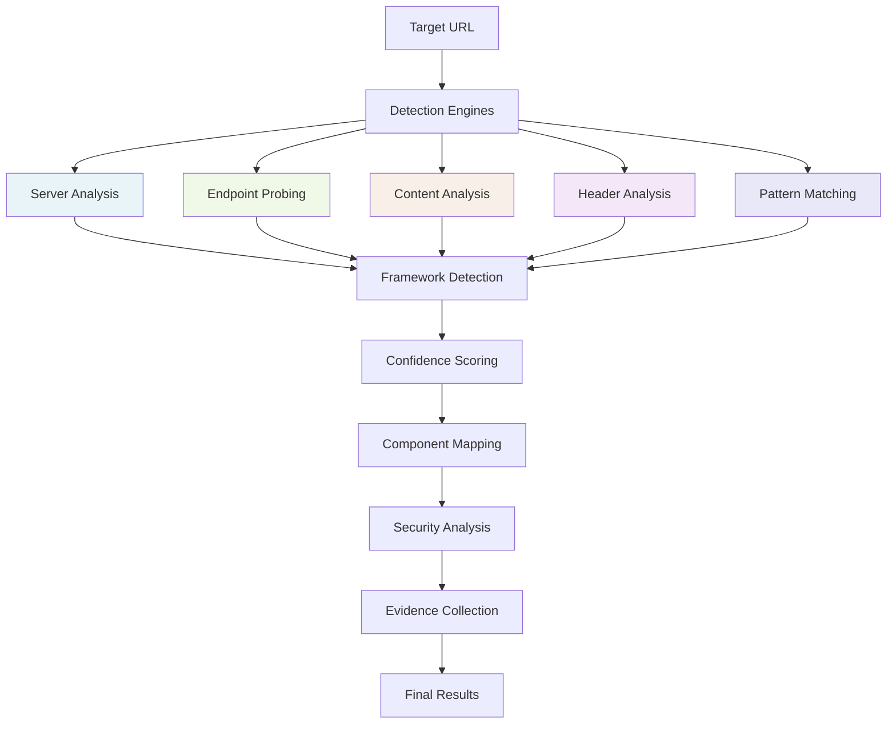

# Framewalk Deep Dive: Comprehensive Framework Detection and Fingerprinting

## Overview

Framewalk is an advanced web application framework detection and fingerprinting tool designed to systematically identify, analyze, and profile web frameworks across single targets or large-scale deployments. Unlike traditional banner grabbing or simple signature matching, Framewalk employs a sophisticated multi-engine detection system that combines passive reconnaissance, active probing, and intelligent analysis to provide comprehensive framework intelligence.

The tool operates through a coordinated detection pipeline that leverages multiple specialized engines, each designed to identify specific framework characteristics through different methodologies. When analyzing a target, Framewalk doesn't just identify what framework is running—it provides detailed confidence scoring, version detection, component mapping, security posture analysis, and actionable intelligence for security researchers and penetration testers.

### Key Features

* **Multi-Engine Detection System**: Employs specialized detection engines for comprehensive framework identification
* **Confidence-Based Scoring**: Provides weighted confidence scores based on multiple detection vectors
* **Component Discovery**: Maps framework-specific components, plugins, and extensions
* **Version Fingerprinting**: Attempts to identify specific framework versions when possible
* **Security Header Analysis**: Evaluates security posture through HTTP security headers
* **Evidence Collection**: Documents detection methodology with detailed evidence chains
* **Batch Processing**: Supports large-scale scanning with multi-target capabilities
* **Framework Filtering**: Allows targeted detection of specific framework families
* **Multiple Output Formats**: Supports both human-readable and machine-parseable output formats
* **Detection Recommendations**: Provides actionable next steps based on identified frameworks

Framewalk excels at transforming basic web reconnaissance into comprehensive framework intelligence, enabling security professionals to:

* Understand target application architecture and technology stack
* Identify framework-specific attack vectors and security testing approaches
* Prioritize testing efforts based on framework-specific vulnerabilities
* Map component relationships and dependencies
* Assess security posture through framework-specific security mechanisms

At its core, Framewalk bridges the gap between initial reconnaissance and targeted security testing by providing the detailed framework intelligence needed to guide subsequent security assessment activities.

## Detection Architecture

Framewalk operates through a sophisticated multi-stage detection pipeline that systematically analyzes web applications through complementary detection methodologies:



### Detection Methodologies

#### 🔍 Server Analysis Engine
Analyzes server headers, response patterns, and infrastructure indicators to identify framework signatures. This engine examines:
- Server headers and version strings
- ASGI/WSGI server indicators
- Runtime environment detection
- Infrastructure fingerprints

#### 🌐 Endpoint Probing Engine  
Systematically probes common Python framework-specific endpoints to confirm framework presence. This includes:
- Django admin interfaces (`/admin/`)
- API documentation endpoints (`/docs`, `/redoc`, `/api/`)
- Debug interfaces and development tools (`/console`, `/_debug_toolbar/`)
- Python framework-specific resource paths

#### 📄 Content Analysis Engine
Examines response content for framework-specific patterns, templates, and artifacts:
- HTML template signatures
- JavaScript framework indicators
- CSS framework patterns
- Error page analysis

#### 🔒 Header Analysis Engine
Evaluates HTTP headers for framework-specific security configurations and patterns:
- Security header presence and configuration
- Framework-specific header patterns
- Cookie structure analysis
- CORS policy indicators

#### 🎯 Pattern Matching Engine
Applies advanced pattern recognition across multiple detection vectors:
- Regex-based signature matching
- Behavioral pattern analysis
- Component relationship mapping
- Version-specific indicators

## Use Cases and Command Reference

### Basic Framework Detection

#### Getting Started with Vimana Framework

The Vimana framework provides a comprehensive suite of security testing tools. Let's start by exploring the available plugins:

```bash
vimana
```


Let's first check what options are available with the `list` command, just run:
```bash
vimana list
```


#### Listing Available Plugins

To see all available plugins in the Vimana framework:

```bash
vimana list --plugins
```


As shown in the output, Framewalk is classified as a **fingerprint** plugin, designed specifically for framework detection and analysis.

#### Plugin Information and Capabilities

To get detailed information about Framewalk's capabilities:

```bash
vimana info --plugin framewalk
```


The plugin information reveals key capabilities including multi-engine detection, confidence scoring, and comprehensive framework analysis.

#### Plugin Arguments and Options

Before running Framewalk against a target, let's check what arguments are available using `guide` command:
```bash
vimana guide --plugin framewalk --args
```


To see practical examples of using Framewalk in different scenarios just run:
```bash
vimana guide -p framewalk --examples
```


### Single Target Framework Detection

#### Basic Target Analysis

The most straightforward use of Framewalk is single target detection. Let's analyze a web application to understand its framework stack:

```bash
vimana run framewalk --target-url http://127.0.0.1:5000/
```

#### 🔌 Detection Process Visualization

The detection process begins with the Framewalk ASCII art banner and then proceeds through systematic analysis:


The output shows the multi-engine detection system in action:
- **Running engines**: 5 detection engines processing simultaneously
- **Running detectors**: 5 specialized detectors analyzing different aspects

#### 🔍 Comprehensive Analysis Results


The scan results provide multiple layers of information:

##### Target Information
- **Target**: `http://127.0.0.1:5000/`
- **Scan time**: 0.20 seconds (indicating efficient detection)
- **IP**: 127.0.0.1 (localhost development environment)

##### Security Posture Analysis
The security headers table reveals a concerning security posture:
- **All major security headers missing**: HSTS, CSP, X-Content-Type-Options, etc.
- This indicates a development environment or poorly configured production system
- Critical for prioritizing security testing approaches

##### Framework Detection Results
The detection results show a **medium-confidence Flask detection** (43%):
- **Primary Framework**: Flask with Werkzeug 2.0.3
- **Version Identified**: Werkzeug 2.0.3 (significant for vulnerability research)
- **Components Detected**: Werkzeug Debugger (high-risk component)

##### Confidence Scoring Analysis
The confidence levels reveal important intelligence priorities:
- **Flask (43%)**: Medium confidence suggests legitimate detection
- **Other frameworks (3% each)**: Low baseline scores from generic Python indicators

#### 🎯 Evidence Chain Analysis


The evidence section provides crucial forensic information:

##### Framework-Specific Evidence
**Flask Detection Evidence**:
- **Header Analysis**: Server header contains "Werkzeug/2.0.3 Python/3.6.9"
- **Version Leakage**: Python 3.6.9 version exposed
- **Debug Interface**: Werkzeug debugger console found at `/console`
- **Security Issue**: "DON'T PANIC" message indicates debug mode enabled

**Generic Python Evidence** (explaining low scores for other frameworks):
- All frameworks show 3% confidence due to Python version leakage
- This demonstrates Framewalk's discrimination between generic and specific indicators

#### 🚨 Security Implications

The detection reveals several critical security concerns:

1. **Debug Mode Enabled**: Werkzeug debugger console accessible
2. **Version Information Disclosure**: Exact Python and Werkzeug versions exposed
3. **Missing Security Headers**: Complete absence of security controls
4. **Development Configuration**: Likely running in development mode

#### 📊 Detection Confidence Interpretation

Understanding confidence scores is crucial for accurate assessment:

- **43% Flask**: Solid detection based on multiple specific indicators
- **3% Others**: Baseline noise from generic Python indicators
- **Component Detection**: Werkzeug Debugger represents high-value intelligence

The **medium/low confidence** recommendation suggests manual verification, which is appropriate given the security-sensitive nature of the detected debug interface.

### Multi-Target Framework Analysis

#### Batch Processing with Summary Mode

For large-scale assessments, Framewalk supports batch processing with summarized output to provide strategic intelligence across multiple targets:

```bash
vimana run framewalk --file siddhis/framewalk/targets.txt --summary-only
```

#### 🎯 Streamlined Detection Process


The summary mode provides efficient processing across multiple targets:
- **Target Processing**: Sequential analysis of each target in the file
- **Condensed Output**: Summary-only flag eliminates detailed evidence chains
- **Performance Optimization**: Faster processing for large target sets

#### 📈 Aggregate Intelligence Analysis


The aggregate results provide strategic intelligence for security planning:

##### Framework Distribution Analysis
The framework distribution table reveals the technology landscape:
- **FastAPI**: 100% prevalence (3/3 targets) - Modern API framework adoption
- **Django**: 100% prevalence (3/3 targets) - Enterprise web framework presence  
- **Flask**: 100% prevalence (3/3 targets) - Ubiquitous Python web development
- **Pyramid & Bottle**: 66.7% prevalence - Specialized framework detection

##### Target Prioritization Matrix
The target details provide operational intelligence:

**High-Confidence Targets**:
- `localhost:8003` - **FastAPI (100%)** - 7 components, 0.16s scan
- `localhost:8000` - **Django (100%)** - 1 component, 17.38s scan

**Medium-Confidence Targets**:
- `127.0.0.1:5000` - **Flask (43%)** - 1 component, 0.20s scan

##### Strategic Recommendations

The aggregate analysis provides actionable intelligence:

1. **Technology Stack Diversity**: Diverse framework usage suggests varied attack surfaces
2. **Framework Family Targeting**: Consider framework-specific security testing approaches
3. **Resource Allocation**: High-confidence detections warrant priority investigation
4. **Performance Indicators**: Scan time variations may indicate complexity or security measures

#### Detailed Multi-Target Analysis

When running multi-target scans without the `--summary-only` flag, Framewalk provides comprehensive detailed output for each target. This mode is essential for deep forensic analysis and evidence collection across multiple targets.
<details>
<summary>Show full DMT Output</summary>

```python
(vfe0.8) ➟ vimana run framewalk --file siddhis/framewalk/targets.txt 

[Target 1/3] Scanning: http://localhost:8003
╭──────────────────────────────────────────────────────────────────────────────────────────────────────────────────────────────────────────────────────────────────────────────────────────────────────────────────╮
│                                                                                                                                                                                                                  │
│                         ●                                                                                                                                                                                        │
│                                            ╭──────╨─────────╮                                                                                                                                                    │
│                                            │            ◎   │                                                                                                                                                    │
│                                            │  ╭──────╮      │                                                                                                                                                    │
│                                            │  │Bottle░      │                                                                                                                                                    │
│       ╔═══════════════════════╗            │  ╰──┬───╯      │                                                                                                                                                    │
│       ║ ╭────╮  FRAMEWALK  ★  ║╮           │     │          │                                                                                                                                                    │
│       ║ │ ◎─│───────────────────◎          │  ╭──┴───╮      │                                                                                                                                                    │
│       ║ ╰────╯                ║╯           │  │Sanic ├──────┤                                                                                                                                                    │
│ ╭─────╨─────────╮             ║            │  ╰──────╯      │                                                                                                                                                    │
│ │  ╭──────╮     │             ║            │             ╭──┴───╮                                                                                                                                                │
│ │  │Django├──┬──╯       ╭─────╯            └─────╭───────┤Web2py│                                                                                                                                                │
│ │  ╰──────╯  │     ╭────┴╮                       │       ╰──────╯                                                                                                                                                │
│ ╰─────┬──────╯     │Flask│───●──●──●─────────────╯                                                                                                                                                               │
│       │  ●         ╰──╭──╯                                                                                                                                                                                       │
│    ╭──┴────╮   ╭─────╯│       ╭──●                                                                                                                                                                               │
│    │FastAPI ───╯      ╰───────│                                                                                                                                                                                  │
│    ╰───────╯                  ╰──● Tornado                                                                                                                                                                       │
│                                                                                                                                                                                                                  │
│                                                                                                                                                                                                                  │
╰──────────────────────────────────────────────────────────────────────────────────────────────────────────────────────────────────────────────────────────────────────────────────────────────────────────────────╯
  Running engines   ━━━━━━━━━━━━━━━━━━━━━━━━━━━━━━━━━━━━━━━━ 5/5 0:00:00
  Running detectors ━━━━━━━━━━━━━━━━━━━━━━━━━━━━━━━━━━━━━━━━ 5/5 0:00:00


─────────────────────────────────────────────────────────────────────────────────────────────────── Scan Results ───────────────────────────────────────────────────────────────────────────────────────────────────

Target: http://localhost:8003
Scan time: 0.16 seconds
IP: 127.0.0.1
Server: uvicorn

Security Headers:
╭────────────────────────┬─────────╮
│ Header                 │ Status  │
├────────────────────────┼─────────┤
│ HSTS                   │ Missing │
│ CSP                    │ Missing │
│ X-Content-Type-Options │ Missing │
│ X-Frame-Options        │ Missing │
│ X-XSS-Protection       │ Missing │
│ Referrer-Policy        │ Missing │
│ Permissions-Policy     │ Missing │
│ COEP                   │ Missing │
│ COOP                   │ Missing │
│ CORP                   │ Missing │
╰────────────────────────┴─────────╯

Detected Frameworks:
╭───────────┬─────────────────────────────┬─────────┬───────────────────────────────────────────────────────────────────╮
│ Framework │ Confidence                  │ Version │ Components                                                        │
├───────────┼─────────────────────────────┼─────────┼───────────────────────────────────────────────────────────────────┤
│ FastAPI   │ 100% [████████████████████] │ 0.89+   │ Swagger UI, FastAPI OAuth2, OpenAPI, Health Check, Uvicorn, ReDoc │
│ Django    │ 16% [███░░░░░░░░░░░░░░░░░]  │ Unknown │ Django REST Framework                                             │
│ Flask     │ 4% [░░░░░░░░░░░░░░░░░░░░]   │ Unknown │ None detected                                                     │
╰───────────┴─────────────────────────────┴─────────┴───────────────────────────────────────────────────────────────────╯

Detection Evidence:
Evidence by Framework
├── FastAPI
│   ├── Server
│   │   ├── ASGI server detected: uvicorn
│   │   └── Uvicorn ASGI server detected
│   ├── Endpoint
│   │   ├── /docs returns 200 OK
│   │   ├── /redoc returns 200 OK
│   │   └── /openapi.json returns 200 OK
│   ├── Documentation
│   │   ├── Swagger UI detected at /docs
│   │   └── ReDoc detected at /redoc
│   ├── Component
│   │   ├── Swagger UI (Documentation at /docs)
│   │   ├── ReDoc (Documentation at /redoc)
│   │   ├── OpenAPI (Schema version: 3.1.0)
│   │   ├── Uvicorn (ASGI server: uvicorn)
│   │   ├── FastAPI OAuth2 (OAuth2 authentication)
│   │   └── Health Check (Health check endpoint)
│   ├── OpenAPI
│   │   └── OpenAPI schema found at /openapi.json
│   ├── Header
│   │   └── Server header contains uvicorn: uvicorn
│   ├── Dependency
│   │   ├── FastAPI OAuth2 detected at /docs/oauth2-redirect
│   │   └── Health Check detected at /health
│   ├── Schema
│   │   ├── OpenAPI schema at /openapi.json
│   │   └── FastAPI schema indicators (29 patterns)
│   └── Content
│       └── FastAPI reference in HTML
├── Django
│   ├── Server
│   │   └── ASGI server detected: uvicorn
│   ├── API
│   │   ├── ReDoc API docs at /redoc/
│   │   └── OpenAPI schema at /redoc/
│   └── Component
│       └── Django REST Framework (API component at /redoc/)
└── Flask
    └── Path
        └── Common Flask path exists: /docs/

Recommendations:
• Primary target appears to be: FastAPI
• High confidence detection - proceed with framework-specific testing

────────────────────────────────────────────────────────────────────────────────


[Target 2/3] Scanning: http://localhost:8000
  Running engines   ━━━━━━━━━━━━━━━━━━━━━━━━━━━━━━━━━━━━━━━━ 5/5 0:00:04
  Running detectors ━━━━━━━━━━━━━━━━━━━━━━━━━━━━━━━━━━━━━━━━ 5/5 0:00:12


─────────────────────────────────────────────────────────────────────────────────────────────────── Scan Results ───────────────────────────────────────────────────────────────────────────────────────────────────

Target: http://localhost:8000
Scan time: 17.38 seconds
IP: 127.0.0.1

Security Headers:
╭────────────────────────┬─────────╮
│ Header                 │ Status  │
├────────────────────────┼─────────┤
│ X-Frame-Options        │ Present │
│ HSTS                   │ Missing │
│ CSP                    │ Missing │
│ X-Content-Type-Options │ Missing │
│ X-XSS-Protection       │ Missing │
│ Referrer-Policy        │ Missing │
│ Permissions-Policy     │ Missing │
│ COEP                   │ Missing │
│ COOP                   │ Missing │
│ CORP                   │ Missing │
╰────────────────────────┴─────────╯

Detected Frameworks:
╭───────────┬─────────────────────────────┬─────────┬───────────────╮
│ Framework │ Confidence                  │ Version │ Components    │
├───────────┼─────────────────────────────┼─────────┼───────────────┤
│ Django    │ 100% [████████████████████] │ All     │ Django Admin  │
│ Flask     │ 3% [░░░░░░░░░░░░░░░░░░░░]   │ Unknown │ None detected │
│ FastAPI   │ 3% [░░░░░░░░░░░░░░░░░░░░]   │ Unknown │ None detected │
│ Pyramid   │ 3% [░░░░░░░░░░░░░░░░░░░░]   │ Unknown │ None detected │
│ Bottle    │ 3% [░░░░░░░░░░░░░░░░░░░░]   │ Unknown │ None detected │
╰───────────┴─────────────────────────────┴─────────┴───────────────╯

Detection Evidence:
Evidence by Framework
├── Django
│   ├── Header
│   │   ├── Header contains Python reference: server
│   │   └── Django-like Vary header with Cookie
│   ├── Security Header
│   │   └── Django default X-Frame-Options: SAMEORIGIN
│   ├── Server
│   │   └── Python version leak: 3.6.9
│   ├── Endpoint
│   │   ├── /admin/ returns 200 OK
│   │   └── /admin/login/ returns 200 OK
│   ├── Content
│   │   ├── CSRF middleware token found in HTML
│   │   ├── Django reference in HTML
│   │   ├── Django admin static path found
│   │   ├── Django admin interface detected
│   │   ├── Django admin login page
│   │   ├── Django admin login next parameter
│   │   └── Django admin login CSRF protection
│   ├── Component
│   │   └── Django Admin (Admin interface detected)
│   ├── JavaScript
│   │   └── Django jQuery namespace
│   └── Security
│       └── Django default X-Frame-Options: SAMEORIGIN
├── Flask
│   ├── Header
│   │   └── Header contains Python reference: server
│   └── Server
│       └── Python version leak: 3.6.9
├── FastAPI
│   ├── Header
│   │   └── Header contains Python reference: server
│   └── Server
│       └── Python version leak: 3.6.9
├── Pyramid
│   ├── Header
│   │   └── Header contains Python reference: server
│   └── Server
│       └── Python version leak: 3.6.9
└── Bottle
    ├── Header
    │   └── Header contains Python reference: server
    └── Server
        └── Python version leak: 3.6.9

Recommendations:
• Primary target appears to be: Django
• High confidence detection - proceed with framework-specific testing
• Try these tools: djunch, dmt, jungle

────────────────────────────────────────────────────────────────────────────────


[Target 3/3] Scanning: http://127.0.0.1:5000/
  Running engines   ━━━━━━━━━━━━━━━━━━━━━━━━━━━━━━━━━━━━━━━━ 5/5 0:00:00
  Running detectors ━━━━━━━━━━━━━━━━━━━━━━━━━━━━━━━━━━━━━━━━ 5/5 0:00:00


─────────────────────────────────────────────────────────────────────────────────────────────────── Scan Results ───────────────────────────────────────────────────────────────────────────────────────────────────

Target: http://127.0.0.1:5000/
Scan time: 0.20 seconds
IP: 127.0.0.1

Security Headers:
╭────────────────────────┬─────────╮
│ Header                 │ Status  │
├────────────────────────┼─────────┤
│ HSTS                   │ Missing │
│ CSP                    │ Missing │
│ X-Content-Type-Options │ Missing │
│ X-Frame-Options        │ Missing │
│ X-XSS-Protection       │ Missing │
│ Referrer-Policy        │ Missing │
│ Permissions-Policy     │ Missing │
│ COEP                   │ Missing │
│ COOP                   │ Missing │
│ CORP                   │ Missing │
╰────────────────────────┴─────────╯

Detected Frameworks:
╭───────────┬────────────────────────────┬────────────────┬───────────────────╮
│ Framework │ Confidence                 │ Version        │ Components        │
├───────────┼────────────────────────────┼────────────────┼───────────────────┤
│ Flask     │ 43% [████████░░░░░░░░░░░░] │ Werkzeug 2.0.3 │ Werkzeug Debugger │
│ Django    │ 3% [░░░░░░░░░░░░░░░░░░░░]  │ Unknown        │ None detected     │
│ FastAPI   │ 3% [░░░░░░░░░░░░░░░░░░░░]  │ Unknown        │ None detected     │
│ Pyramid   │ 3% [░░░░░░░░░░░░░░░░░░░░]  │ Unknown        │ None detected     │
│ Bottle    │ 3% [░░░░░░░░░░░░░░░░░░░░]  │ Unknown        │ None detected     │
╰───────────┴────────────────────────────┴────────────────┴───────────────────╯

Detection Evidence:
Evidence by Framework
├── Flask
│   ├── Header
│   │   ├── Header contains Flask/Werkzeug reference: server
│   │   ├── Header contains Python reference: server
│   │   └── Server header contains Werkzeug: Werkzeug/2.0.3 Python/3.6.9
│   ├── Server
│   │   └── Python version leak: 3.6.9
│   ├── Debug
│   │   ├── Werkzeug debugger console found at /console
│   │   └── Werkzeug 'DON'T PANIC' message found
│   └── Component
│       └── Werkzeug Debugger (Interactive console found)
├── Django
│   ├── Header
│   │   └── Header contains Python reference: server
│   └── Server
│       └── Python version leak: 3.6.9
├── FastAPI
│   ├── Header
│   │   └── Header contains Python reference: server
│   └── Server
│       └── Python version leak: 3.6.9
├── Pyramid
│   ├── Header
│   │   └── Header contains Python reference: server
│   └── Server
│       └── Python version leak: 3.6.9
└── Bottle
    ├── Header
    │   └── Header contains Python reference: server
    └── Server
        └── Python version leak: 3.6.9

Recommendations:
• Primary target appears to be: Flask
• Medium/low confidence detection - use manual verification techniques
• Consider deeper analysis with more invasive techniques

────────────────────────────────────────────────────────────────────────────────


────────────────────────────────────────────────────────────────────────────────────────────── Aggregate Scan Results ──────────────────────────────────────────────────────────────────────────────────────────────

Scanned Targets: 3
Total Scan Time: 17.79 seconds
Timestamp: 2025-06-23 10:53:07

Framework Distribution:
╭───────────┬───────┬────────────┬──────────────────────╮
│ Framework │ Count │ Percentage │ Distribution         │
├───────────┼───────┼────────────┼──────────────────────┤
│ FastAPI   │ 3     │ 100.0%     │ ████████████████████ │
│ Django    │ 3     │ 100.0%     │ ████████████████████ │
│ Flask     │ 3     │ 100.0%     │ ████████████████████ │
│ Pyramid   │ 2     │ 66.7%      │ █████████████░░░░░░░ │
│ Bottle    │ 2     │ 66.7%      │ █████████████░░░░░░░ │
╰───────────┴───────┴────────────┴──────────────────────╯

Target Details:
╭────────────────────────┬───────────────┬─────────────────────────────┬───────────┬────────────┬────────────╮
│ Target URL             │ Top Framework │ Confidence                  │ Scan Time │ Frameworks │ Components │
├────────────────────────┼───────────────┼─────────────────────────────┼───────────┼────────────┼────────────┤
│ http://localhost:8003  │ FastAPI       │ 100% [████████████████████] │ 0.16s     │ 3          │ 7          │
│ http://localhost:8000  │ Django        │ 100% [████████████████████] │ 17.38s    │ 5          │ 1          │
│ http://127.0.0.1:5000/ │ Flask         │ 43% [████████░░░░░░░░░░░░]  │ 0.20s     │ 5          │ 1          │
╰────────────────────────┴───────────────┴─────────────────────────────┴───────────┴────────────┴────────────╯

Recommendations:
• Most common framework detected: FastAPI
• Diverse framework usage detected - consider targeting specific framework families

```
</details>

#### 🔬 Detailed Output Analysis

The comprehensive multi-target output provides forensic-level intelligence for each target:

##### Target 1: FastAPI Application Analysis
**http://localhost:8003** demonstrates a modern API-first architecture:
- **100% Confidence Detection**: Multiple confirming indicators
- **7 Components Identified**: Swagger UI, OAuth2, OpenAPI, Health Check, Uvicorn, ReDoc
- **Security Posture**: All security headers missing (development environment)
- **Attack Surface**: Rich API documentation endpoints (`/docs`, `/redoc`, `/openapi.json`)

**Key Security Implications**:
- Exposed API documentation may reveal internal API structure
- OAuth2 authentication mechanisms present but may need security review
- Health check endpoints could provide system status information

##### Target 2: Django Enterprise Application
**http://localhost:8000** shows enterprise-grade configuration:
- **100% Confidence Detection**: Multiple Django-specific indicators
- **Extended Scan Time**: 17.38 seconds suggests complex application or security measures
- **Admin Interface Detected**: Django admin accessible (high-value target)
- **Security Headers**: X-Frame-Options present (better security posture)

**Key Security Implications**:
- Django admin interface represents high-value target for attackers
- CSRF middleware tokens indicate some security awareness
- Database interaction patterns visible in evidence chain

##### Target 3: Flask Development Application  
**http://127.0.0.1:5000** represents development environment:
- **43% Confidence**: Medium confidence with debug interface detected
- **Critical Security Issue**: Werkzeug debugger console accessible
- **Version Disclosure**: Exact Python and Werkzeug versions exposed
- **No Security Headers**: Complete absence of security controls

**Key Security Implications**:
- Debug console provides potential code execution capability
- Development configuration in production represents critical risk
- Version information aids in targeted exploit development

#### 🎯 Cross-Target Intelligence Correlation

The multi-target analysis reveals important patterns:

1. **Framework Diversity**: Each target runs different primary frameworks
2. **Security Maturity Spectrum**: From development (Flask) to production (Django)
3. **Component Complexity**: Varies from simple (1 component) to complex (7 components)
4. **Detection Confidence**: Ranges from medium (43%) to absolute (100%)

### Advanced Framework Filtering

#### Strategic Framework Filtering

In large-scale assessments with hundreds or thousands of targets, you may need to focus on specific framework families for targeted security testing. The framework filtering capability enables efficient resource allocation by identifying only targets running specific technologies.

**Use Case Scenario**: You need to identify FastAPI targets from a large target list for API-specific security testing:

```bash
vimana run framewalk --file siddhis/framewalk/targets.txt --frameworks FastAPI
```

#### 🎯 Filtered Detection Process


The filtering process maintains the same detection quality while focusing on specific frameworks:
- **Targeted Detection**: Only FastAPI-related evidence is processed and reported
- **Performance Optimization**: Reduces processing overhead by filtering irrelevant detections
- **Resource Efficiency**: Eliminates noise from unwanted framework detections

#### 📊 Filtered Results Analysis


The filtered results provide focused intelligence:

##### FastAPI-Specific Detection
For targets where FastAPI is detected with confidence:
- **Detailed Evidence**: Complete evidence chain for FastAPI detection
- **Component Mapping**: Specific FastAPI components and versions
- **Security Analysis**: FastAPI-specific security considerations
- **Recommendations**: Targeted next steps for FastAPI security testing

#### 🚫 Non-Matching Target Handling


For targets not running the specified framework:
- **Efficient Filtering**: "No frameworks detected with confidence" message
- **Resource Conservation**: Minimal processing for non-matching targets
- **Clear Indication**: Explicit notification when framework filter doesn't match

#### Strategic Applications of Framework Filtering

##### Penetration Testing Scenarios
1. **API-Focused Assessments**: Filter for FastAPI, Django REST Framework, Flask-RESTX
2. **Admin Interface Targeting**: Focus on Django admin interfaces and authentication systems
3. **Legacy Python System Identification**: Target older Python framework versions
4. **Microservice Analysis**: Identify Python-based microservice frameworks

##### Red Team Operations
1. **Framework-Specific Exploits**: Target known vulnerabilities in specific frameworks
2. **Attack Surface Reduction**: Focus on high-value framework targets
3. **Payload Customization**: Adapt attacks to framework-specific characteristics
4. **Stealth Operations**: Minimize detection by targeting specific technologies

##### Blue Team Defense
1. **Asset Inventory**: Catalog framework usage across infrastructure
2. **Vulnerability Management**: Prioritize patching based on framework detection
3. **Security Baseline**: Assess security posture of specific framework families
4. **Compliance Monitoring**: Track framework security configurations

## Machine-Readable Output

### JSON Output Format

For automated processing and integration with other security tools, Framewalk supports structured JSON output. This format is essential for programmatic analysis, reporting systems, and security orchestration platforms:
```Json
{
  "target": "http://127.0.0.1:5000/",
  "scan_time": 0.1682591438293457,
  "timestamp": "2025-06-23 11:10:25",
  "ip_info": {
    "hostname": "127.0.0.1",
    "ip": "127.0.0.1"
  },
  "server_info": {},
  "security": {
    "headers": {
      "present": [],
      "missing": [
        "HSTS",
        "CSP",
        "X-Content-Type-Options",
        "X-Frame-Options",
        "X-XSS-Protection",
        "Referrer-Policy",
        "Permissions-Policy",
        "COEP",
        "COOP",
        "CORP"
      ]
    }
  },
  "frameworks": [
    {
      "name": "Flask",
      "confidence": 43,
      "version": "Werkzeug 2.0.3",
      "components": [
        "Werkzeug Debugger"
      ],
      "vulnerabilities": [],
      "metadata": {
        "description": "Lightweight WSGI web application framework",
        "website": "https://flask.palletsprojects.com/"
      },
      "evidence": {
        "Header": [
          "Header contains Flask/Werkzeug reference: server",
          "Header contains Python reference: server",
          "Server header contains Werkzeug: Werkzeug/2.0.3 Python/3.6.9"
        ],
        "Server": [
          "Python version leak: 3.6.9"
        ],
        "Debug": [
          "Werkzeug debugger console found at /console",
          "Werkzeug 'DON'T PANIC' message found"
        ],
        "Component": [
          "Werkzeug Debugger (Interactive console found)"
        ]
      }
    },
    {
      "name": "Django",
      "confidence": 3,
      "version": "Unknown",
      "components": [],
      "vulnerabilities": [],
      "metadata": {
        "description": "High-level Python web framework",
        "website": "https://www.djangoproject.com/"
      },
      "evidence": {
        "Header": [
          "Header contains Python reference: server"
        ],
        "Server": [
          "Python version leak: 3.6.9"
        ]
      }
    },
    {
      "name": "FastAPI",
      "confidence": 3,
      "version": "Unknown",
      "components": [],
      "vulnerabilities": [],
      "metadata": {
        "description": "Modern, fast, web framework for building APIs",
        "website": "https://fastapi.tiangolo.com/"
      },
      "evidence": {
        "Header": [
          "Header contains Python reference: server"
        ],
        "Server": [
          "Python version leak: 3.6.9"
        ]
      }
    },
    {
      "name": "Pyramid",
      "confidence": 3,
      "version": "Unknown",
      "components": [],
      "vulnerabilities": [],
      "metadata": {
        "description": "Small, fast, down-to-earth Python web framework",
        "website": "https://trypyramid.com/"
      },
      "evidence": {
        "Header": [
          "Header contains Python reference: server"
        ],
        "Server": [
          "Python version leak: 3.6.9"
        ]
      }
    },
    {
      "name": "Bottle",
      "confidence": 3,
      "version": "Unknown",
      "components": [],
      "vulnerabilities": [],
      "metadata": {
        "description": "Fast and simple micro-framework for Python web applications",
        "website": "https://bottlepy.org/"
      },
      "evidence": {
        "Header": [
          "Header contains Python reference: server"
        ],
        "Server": [
          "Python version leak: 3.6.9"
        ]
      }
    }
  ]
}
```

### JSON Structure Analysis

The JSON output provides comprehensive structured intelligence for automated processing:

#### 🎯 Core Detection Metadata
```json
{
  "target": "http://127.0.0.1:5000/",
  "scan_time": 0.1682591438293457,
  "timestamp": "2025-06-23 11:10:25"
}
```
- **Target URL**: Exact target analyzed
- **Performance Metrics**: Scan execution time
- **Temporal Context**: Timestamp for correlation analysis

#### 🌐 Infrastructure Intelligence
```json
{
  "ip_info": {
    "hostname": "127.0.0.1",
    "ip": "127.0.0.1"
  },
  "server_info": {}
}
```
- **Network Information**: IP and hostname resolution
- **Server Details**: Infrastructure context (when available)

#### 🔒 Security Posture Assessment
```json
{
  "security": {
    "headers": {
      "present": [],
      "missing": [
        "HSTS", "CSP", "X-Content-Type-Options", 
        "X-Frame-Options", "X-XSS-Protection", 
        "Referrer-Policy", "Permissions-Policy",
        "COEP", "COOP", "CORP"
      ]
    }
  }
}
```
- **Present Headers**: Active security controls
- **Missing Headers**: Security gaps and improvement opportunities
- **Risk Assessment**: Basis for security recommendations

#### 📊 Framework Detection Intelligence
```json
{
  "frameworks": [
    {
      "name": "Flask",
      "confidence": 43,
      "version": "Werkzeug 2.0.3",
      "components": ["Werkzeug Debugger"],
      "vulnerabilities": [],
      "metadata": {
        "description": "Lightweight WSGI web application framework",
        "website": "https://flask.palletsprojects.com/"
      },
      "evidence": {
        "Header": ["Server header contains Werkzeug: Werkzeug/2.0.3 Python/3.6.9"],
        "Debug": ["Werkzeug debugger console found at /console"],
        "Component": ["Werkzeug Debugger (Interactive console found)"]
      }
    }
  ]
}
```

**Framework Object Analysis**:
- **Name & Confidence**: Framework identification and reliability score
- **Version Information**: Specific version detected (crucial for vulnerability assessment)
- **Component Mapping**: Associated components and extensions
- **Vulnerability Context**: Placeholder for known security issues
- **Metadata**: Framework description and official resources
- **Evidence Chain**: Detailed detection methodology and indicators

#### 🔍 Evidence Categorization

The evidence structure provides forensic-quality detection documentation:

**Header Evidence**: Server headers, version strings, and HTTP indicators
**Debug Evidence**: Development tools, debug consoles, and diagnostic interfaces  
**Component Evidence**: Framework-specific components and their locations
**Server Evidence**: Runtime environment and version information

### Integration Applications

#### Security Information and Event Management (SIEM)
- **Asset Discovery**: Automated framework inventory
- **Threat Intelligence**: Framework-specific vulnerability correlation
- **Risk Scoring**: Confidence-based prioritization
- **Change Detection**: Framework update monitoring

#### Continuous Security Monitoring
- **CI/CD Integration**: Framework detection in deployment pipelines
- **Compliance Reporting**: Security header compliance tracking
- **Vulnerability Management**: Automated framework version tracking
- **Security Baseline**: Framework security configuration monitoring

#### Threat Hunting and Incident Response
- **Attack Surface Analysis**: Framework-specific attack vector identification
- **Forensic Analysis**: Evidence chain reconstruction
- **Threat Attribution**: Framework-specific attack pattern correlation
- **Incident Classification**: Framework-based incident categorization

## Practical Integration Examples

### Python Integration
```python
import json
import subprocess

def framewalk_scan(target):
    result = subprocess.run([
        'vimana', 'run', 'framewalk', 
        '--target', target, 
        '--output-format', 'json'
    ], capture_output=True, text=True)
    
    return json.loads(result.stdout)

# Analyze results
scan_data = framewalk_scan('https://example.com')
for framework in scan_data['frameworks']:
    if framework['confidence'] > 50:
        print(f"High confidence: {framework['name']} ({framework['confidence']}%)")
```

### Bash Integration
```bash
#!/bin/bash
# Extract high-confidence detections
vimana run framewalk --target "$1" --output-format json | \
jq -r '.frameworks[] | select(.confidence > 50) | "\(.name): \(.confidence)%"'
```

## Conclusion

Framewalk represents a significant advancement in web application framework detection and fingerprinting technology. By combining multiple detection engines, comprehensive evidence collection, and intelligent confidence scoring, it transforms basic reconnaissance into actionable security intelligence.

### Key Advantages

**🎯 Comprehensive Detection**
- Multi-engine architecture provides thorough framework analysis
- Confidence-based scoring enables accurate prioritization
- Component mapping reveals detailed application architecture
- Evidence collection supports forensic-quality documentation

**🚀 Operational Efficiency**  
- Batch processing supports large-scale assessments
- Framework filtering enables targeted analysis
- Multiple output formats support diverse integration needs
- Performance optimization ensures scalable operations

**🔒 Security-Focused Intelligence**
- Security header analysis reveals defensive posture
- Component detection identifies high-value targets
- Version fingerprinting enables vulnerability correlation
- Risk-based recommendations guide testing priorities

**📊 Strategic Value**
- Asset discovery provides infrastructure visibility
- Technology stack mapping supports attack surface analysis
- Compliance monitoring enables security governance
- Threat intelligence integration enhances security operations

### Practical Applications

Framewalk excels across diverse security scenarios:

- **Penetration Testing**: Framework-specific attack vector identification
- **Red Team Operations**: Target prioritization and payload customization
- **Blue Team Defense**: Asset inventory and vulnerability management
- **Compliance Assessment**: Security configuration validation
- **Threat Hunting**: Attack pattern correlation and forensic analysis

### Future Considerations

As web frameworks continue to evolve, Framewalk's multi-engine architecture and evidence-based approach position it to adapt to emerging technologies and detection challenges. The tool's focus on comprehensive intelligence gathering, rather than simple signature matching, ensures continued effectiveness in dynamic threat landscapes.

By bridging the gap between initial reconnaissance and targeted security testing, Framewalk enables security professionals to make informed decisions about testing approaches, resource allocation, and risk priorities based on comprehensive framework intelligence rather than assumptions or incomplete information.

## References

* https://sadhulabs.substack.com/ 
* https://github.com/s4dhulabs/vimana-framework